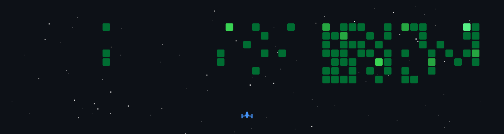

# 💫 About Me:
💻 Core Programming:     HTML, CSS, JavaScript, C   🔰 Beginner Dev:         Python, Java, Node.js, React   🎨 Design Tools:         Photoshop, Illustrator, Animate   🧠 3D & Visuals:         Blender (modeling, texturing, rendering)   📊 Data Tools:           MS Excel, MS Access, SQL, Tableau (beginner)   ☁️ Cloud & Platforms:    Git, GitHub, AWS (beginner), VS Code   

# 🎮 My GitHub Activity Game

  

## 🌐 Socials:
  

# 💻 Tech Stack:
                     
# 📊 GitHub Stats:
 
 

## 🏆 GitHub Trophies

### ✍️ Random Dev Quote

### 🔝 Top Contributed Repo

---

<!-- Proudly created with GPRM ( https://gprm.itsvg.in ) -->
