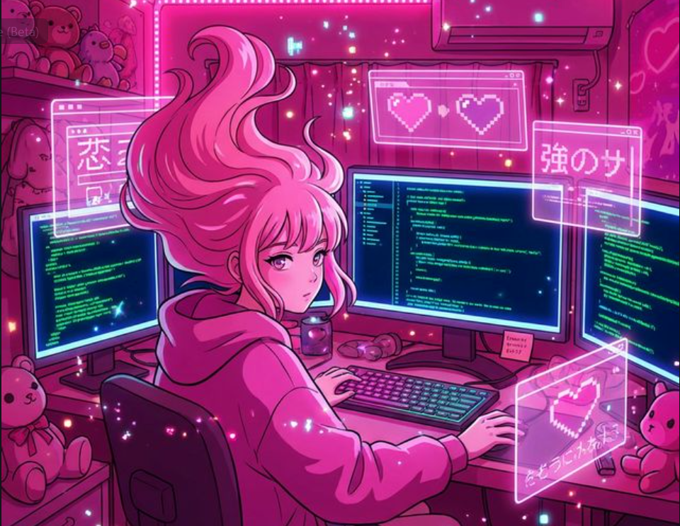

<!-- 
  ╔═══════════════════════════════════════════════════════════════════════════╗
  ║                                                                           ║
  ║   ✨ NAEHA'S PROFILE ✨                                                   ║
  ║   A vibrant, pink-themed developer portfolio                              ║
  ║                                                                           ║
  ╚═══════════════════════════════════════════════════════════════════════════╝
-->

<div align="center">

<!-- ═══════════════════════ ANIMATED HEADER ═══════════════════════ -->


<!-- ═══════════════════════ TYPING ANIMATION ═══════════════════════ -->
<a href="https://github.com/Naeha-S">
  
</a>

<br/>

<!-- ═══════════════════════ BADGES ═══════════════════════ -->
<p>
  
  
  <a href="https://github.com/Naeha-S?tab=followers">
    
  </a>
  
</p>

</div>

<!-- ═══════════════════════ PINK DIVIDER ═══════════════════════ -->


## 💖 About Me

<table>
<tr>
<td width="55%">

```js
const naeha = {
  pronouns: "she/her",
  location: "India 🇮🇳",
  education: "IT Student 🎓",
  
  code: ["HTML", "CSS", "JavaScript", "C", "Python"],
  learning: ["React", "Node.js", "Java"],
  
  creative: {
    design: ["Photoshop", "Illustrator", "Figma"],
    threeD: ["Blender"],
    video: ["Animate"]
  },
  
  currentFocus: "Building beautiful web experiences ✨",
  funFact: "I debug with pink sticky notes! 💖"
};
```

</td>
<td width="45%" align="center" valign="middle">



</td>
</tr>
</table>

<!-- ═══════════════════════ PINK DIVIDER ═══════════════════════ -->


## 💻 Tech Stack

<!-- BENTO GRID LAYOUT -->
<div align="center">

<table>
<tr>
<td align="center" width="25%" style="padding: 20px;">

### 🎀 Languages
<br/>
<br/><br/>
<br/><br/>


</td>
<td align="center" width="25%">

### 🚀 Frontend
<br/>
<br/><br/>
<br/><br/>


</td>
<td align="center" width="25%">

### ⚙️ Backend & DB
<br/>
<br/><br/>
<br/><br/>


</td>
<td align="center" width="25%">

### 🎨 Design
<br/>
<br/><br/>
<br/><br/>


</td>
</tr>
</table>

<br/>

<table>
<tr>
<td align="center" width="50%">

### ☁️ Cloud & DevOps


</td>
<td align="center" width="50%">

### 🛠️ Tools & Workflow


</td>
</tr>
</table>

</div>

<!-- ═══════════════════════ PINK DIVIDER ═══════════════════════ -->


## 🎮 My GitHub Activity Game

<div align="center">
  
  <br/>
  <i>🚀 Live generated gameplay based on my commit history!</i>
</div>

<!-- ═══════════════════════ PINK DIVIDER ═══════════════════════ -->


## ⏱️ Coding Activity

<div align="center">
  
</div>

<!-- ═══════════════════════ PINK DIVIDER ═══════════════════════ -->


## 📊 My Contributions

<div align="center">
  <picture>
    <source media="(prefers-color-scheme: dark)" srcset="https://github-readme-activity-graph.vercel.app/graph?username=Naeha-S&bg_color=0D1117&color=FF1493&line=FF69B4&point=FFFFFF&area=true&area_color=FF1493&hide_border=true">
    <source media="(prefers-color-scheme: light)" srcset="https://github-readme-activity-graph.vercel.app/graph?username=Naeha-S&bg_color=ffffff&color=FF1493&line=FF69B4&point=000000&area=true&area_color=FF69B4&hide_border=true">
    
  </picture>
  
  <br/><br/>
  
  <picture>
    <source media="(prefers-color-scheme: dark)" srcset="https://github-readme-stats.vercel.app/api/top-langs/?username=Naeha-S&layout=donut-vertical&theme=radical&bg_color=0D1117&title_color=FF1493&text_color=FFFFFF&hide_border=true">
    <source media="(prefers-color-scheme: light)" srcset="https://github-readme-stats.vercel.app/api/top-langs/?username=Naeha-S&layout=donut-vertical&theme=flat&bg_color=ffffff&title_color=FF1493&text_color=000000&hide_border=true">
    
  </picture>
</div>

<!-- ═══════════════════════ PINK DIVIDER ═══════════════════════ -->


## 📈 GitHub Stats

<div align="center">
  <picture>
    <source media="(prefers-color-scheme: dark)" srcset="https://github-readme-stats.vercel.app/api?username=Naeha-S&show_icons=true&hide_border=true&bg_color=0D1117&title_color=FF1493&icon_color=FF69B4&text_color=FFFFFF">
    <source media="(prefers-color-scheme: light)" srcset="https://github-readme-stats.vercel.app/api?username=Naeha-S&show_icons=true&hide_border=true&bg_color=ffffff&title_color=FF1493&icon_color=FF69B4&text_color=000000">
    
  </picture>
  <picture>
    <source media="(prefers-color-scheme: dark)" srcset="https://streak-stats.demolab.com?user=Naeha-S&theme=radical&hide_border=true&background=0D1117&stroke=FF1493&ring=FF1493&fire=FF69B4&currStreakNum=FFFFFF&sideNums=FFFFFF&currStreakLabel=FF1493&sideLabels=FF69B4&dates=888888">
    <source media="(prefers-color-scheme: light)" srcset="https://streak-stats.demolab.com?user=Naeha-S&theme=light&hide_border=true&background=ffffff&stroke=FF1493&ring=FF1493&fire=FF69B4&currStreakNum=000000&sideNums=000000&currStreakLabel=FF1493&sideLabels=FF69B4&dates=444444">
    
  </picture>
</div>

<!-- ═══════════════════════ PINK DIVIDER ═══════════════════════ -->


## 🏆 Achievements

<div align="center">
  <picture>
    <source media="(prefers-color-scheme: dark)" srcset="https://github-profile-trophy.vercel.app/?username=Naeha-S&theme=radical&no-frame=true&no-bg=true&margin-w=15&margin-h=15&column=4&row=2">
    <source media="(prefers-color-scheme: light)" srcset="https://github-profile-trophy.vercel.app/?username=Naeha-S&theme=flat&no-frame=true&no-bg=true&margin-w=15&margin-h=15&column=4&row=2">
    
  </picture>
</div>

<!-- ═══════════════════════ PINK DIVIDER ═══════════════════════ -->


## 🌸 Let's Connect

<div align="center">

<table>
<tr>
<td align="center" width="33%">
<a href="https://linkedin.com/in/naeha-s">

</a>
<br/><br/>
<b>Professional Network</b>
<br/>
<sub>Let's connect professionally!</sub>
</td>
<td align="center" width="33%">
<a href="mailto:naeha.s.2024.it@rajalakshmi.edu.in">

</a>
<br/><br/>
<b>Drop a Message</b>
<br/>
<sub>I'd love to hear from you!</sub>
</td>
<td align="center" width="33%">
<a href="https://github.com/Naeha-S">

</a>
<br/><br/>
<b>Check My Work</b>
<br/>
<sub>Explore my repositories!</sub>
</td>
</tr>
</table>

<br/>


</div>

<!-- ═══════════════════════ FOOTER ═══════════════════════ -->
<br/>

<div align="center">
  


<br/>

**💖 Thanks for stopping by! Have a sparkling day! ✨**


</div>
